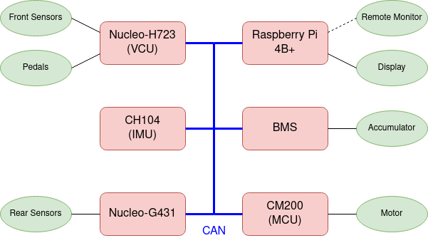
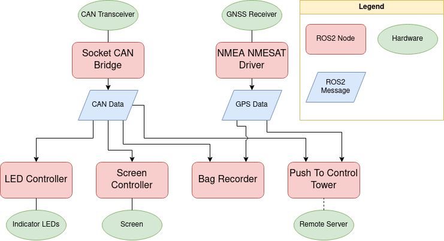

# NTURT ROS

## Introduction

ROS metapackage (package that contains no source for managing other packages) for nturt. It helps to clone all packages used on rpi all at once, and every version only contains stable packages.

### Program structure

Electrical system of nturt.



Program structure of `nturt_ros`.



## Usage

### Cloning

Clone this package and all submodules (other packages managed by this metapackage) in it by

```bash=
git clone https://github.com/NTURacingTeam/nturt_ros.git --recurse-submodules
```

in the ros workspace source directory (such as ~/ws/src/).

### Installing dependcies

The dependencies of this package can be automatically installed using `rosdep`:

```shell=
sudo apt-get update
sudo apt-get upgrade
rosdep install --from-paths src --ignore-src -r -y
```

in the workspace directory (such as ~/ws/).

### Updating

After pulling the update version of this package, update the submodule by

```bash=
git submodule update
```
