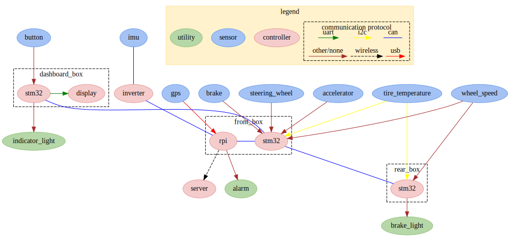
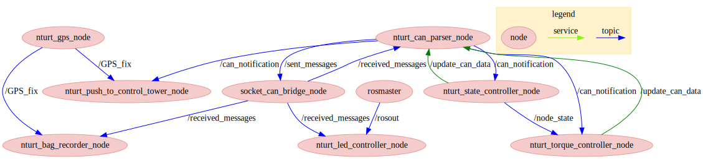

# nturt_ros

## Introduction

ROS metapackage(package that contains no source for managing other packages) for nturt. It helps to clone all packages used on rpi all at once, and every version only contains stable packages.

### Program structure

Electrical system of nturt.



Program structure of `nturt_ros`.



> Picture generated by `graphviz` which is stored in `nturt_ros/doc`.

## Usage

Clone this package and all submodules(other packages managed by this metapackage) in it by

```bash=
git clone https://github.com/NTURacingTeam/nturt_ros.git --recurse-submodules
```

in the ros workspace source directory(such as ~/ws/src/).

After pulling the update version of this package, update the submodule by

```bash=
git submodule update
```

## Known issue

### Compiling error due to ros messages/services  (fixed, maybe)

Since the source and header files for ros msg/srv in `nturt_ros_interface` is generated during compile time, sometimes cmake will run into errors that says it can not find some include files for ros msg/srv. In such case, the easist solution might just be to compile(running `catkin_make`) multiple times until it compiles successfully.

### Compiling error due to `wiringPi` (only for arm computer that`s not rpi)  (fixed, maybe)

Since `wiringPi` is a preinstalled package only for raspberry pi and no other computer can installed properly. Yet it's still required (in c++) in order to control gpios of rpi.

To avoid running compiling error due to not finding `wiringPi`, the work around is

1. Check if `__arm__` macro is defined it the c++ source files. If not, don't use `wiringPi`.
2. Check `if(${CMAKE_SYSTEM_PROCESSOR} MATCHES "arm")` in `CMakeLists.txt`. If false, don't link the binary to `wiringPi`.

Hence, computers that's not arm structure will be fine. Yet computers that are arm structure and not rpi will still compile error. There's probably no solution to such problem, hence this error may not be patched.

The affected packages:

- nturt_state_controller
